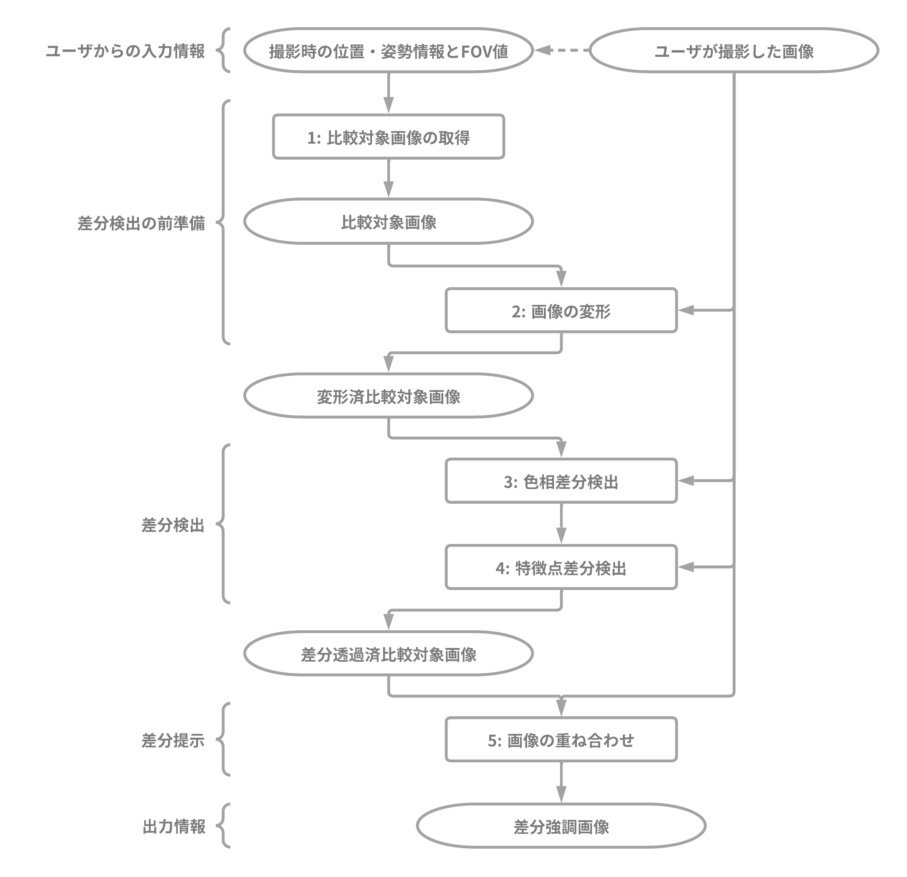

# Project: ARtemis

**_手直し中_**

## なにこれ

カジュアルでトラディショナルなまちがいさがしマシーン

目の前の景色を、過去の任意の時点と比較して差分を検出するぞ！
まちがいさがし用のチートとしても使える(ようにするよ)！

## 処理の流れ

### 差分検出の前準備

差分検出を行う前に必要な処理について

#### 比較対象画像の取得

まず、ユーザから入力された情報をもとに、ユーザが撮影した画像との比較対象として使用する画像を取得する。

ユーザは、撮影した画像と同じ地点・向きのストリートビューのURLと、撮影に用いたカメラのFOV (Field of View)値を入力する。
ストリートビュー画像のダウンロードにはGoogleの[Street View Static API](https://developers.google.com/maps/documentation/streetview)を用い、入力されたURLとFOV値を元に比較対象となる画像を取得する。

#### 画像の変形

先の処理で取得した比較対象の画像を、ユーザが撮影した画像と重なるように変形させる。
これは、画像同士を重ね合わせたときに被写体のずれと歪みを最小限に抑えるために行う処理である。

それぞれの画像に対してA-KAZE (Accelerated-KAZE)による特徴点抽出を行い、得られた特徴量同士のハミング距離を用いてBrute-Forceとk-NN (kth-nearest neighbor)でマッチングする。
このとき、予測時間短縮のためにk-NNのk値を$k=2$としている。
マッチングされた特徴点を利用して、画像同士の歪みを検出するために、ホモグラフィによって2つの画像を関連付ける。
適切な変換のためにRANSAC (Random Sample Consensus)を用いて外れ値を除外したうえで、画像同士の歪みを表すホモグラフィ行列を計算し、比較用画像にそれを適用して射影変換を行う。

変形された比較対象画像と、実際に撮影された画像を重ね合わせ、目視によって大きなずれや歪みについて評価する。

### 差分検出

差分検出に用いる色相差分検出と特徴点差分検出の２つの手法について

2つの手法を用いて差分検出を行う理由は、画素ごとに処理を行う色相差分検出は、どうしても補正できないわずかな画像の歪みによって生じた被写体のずれを差分として検出してしまう。
例えば、空やビルの壁面などの色相に変化の少ない部分に対しては色相差分検出が有効であるが、それらの境界部分や細かい模様などの所謂エッジに対してはあまり効果が無いということだ。
それらのエッジを利用する特徴点を用いて差分検出を追加で行うことで、弱点を補い合うことができるため、2つの手法を用いて差分検出を行なう。

#### 色相差分検出

色相を用いた差分の検出を、先の処理で変形された比較対象の画像とユーザが撮影した画像の間で行う。
その後、差分が検出された箇所を残し、それ以外は比較対象の画像から除去する。

色相の比較には、画像中の画素の色相値のみを用いる。
色相値のみを用いることで天気や撮影時間によって異なる、照明の影響をできるだけ排除できる。
また、互いに同座標の画素同士に対して実行される。
色相値は$0^{\circ}$から$179^{\circ}$の間で表され、その数値の差によって差分を検出する。

### 特徴点差分検出

特徴点を用いた差分の検出を、先の処理で色相差分が除去された比較対象の画像とユーザが撮影した画像の間で行う。
その後、差分が検出された箇所を残し、それ以外は比較対象の画像から除去する。

特徴点の比較には、それぞれの画像に対してA-KAZEによる特徴点抽出を行い、得られた特徴量同士のハミング距離を用いてBrute-Forceとk-NNでマッチングする。
このとき、予測時間短縮のためにk-NNのk値を$k=2$としている。
マッチングされた特徴点について、特徴点同士の画像における座標のユークリッド距離によって差分を検出する。
その後、差分として検出された特徴点以外の、差分が無いと判断された特徴点は除去される。
ここでは、特徴点を中心とした円状の区画が比較対象の画像から除去される。
その円の半径は比較対象画像の一辺の長さの$1/40$としている。

### 差分提示

検出した差分提示の手法について

#### 画像の重ね合わせ

差分が検出された箇所は過去の姿で、検出されていない箇所はそのままの姿で表示した画像を出力する。

ここまでの処理で、検出した差分箇所のみが残り、差分が無い箇所は除去された画像が完成した。
この画像を、ユーザが撮影した画像に重ねることで、差分のあった箇所をユーザに提示する。

---

